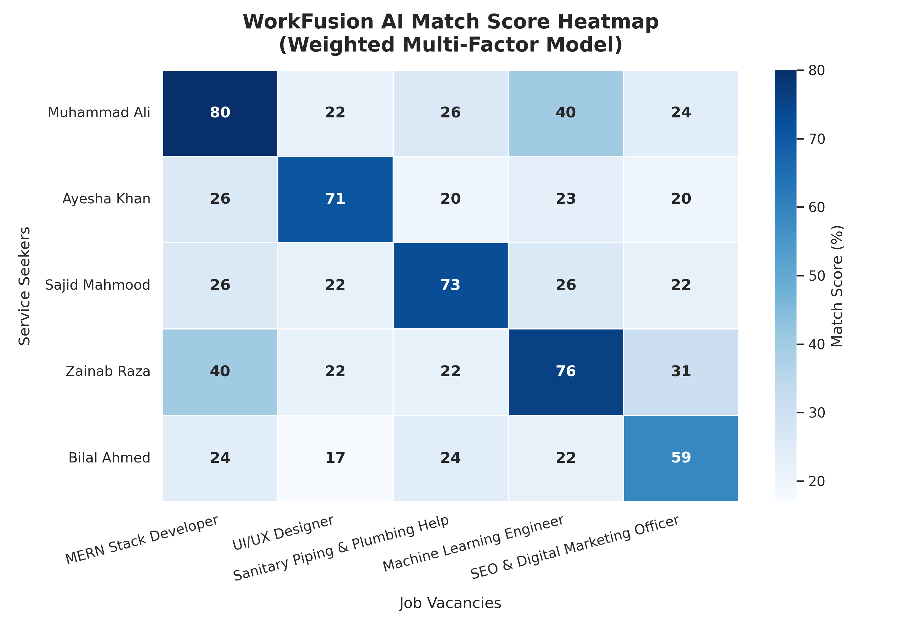
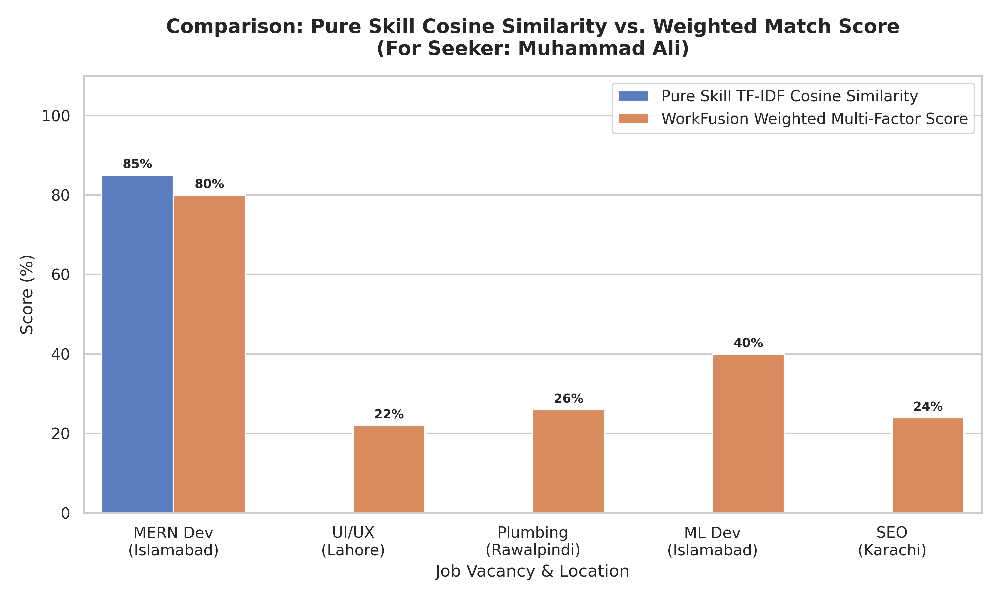
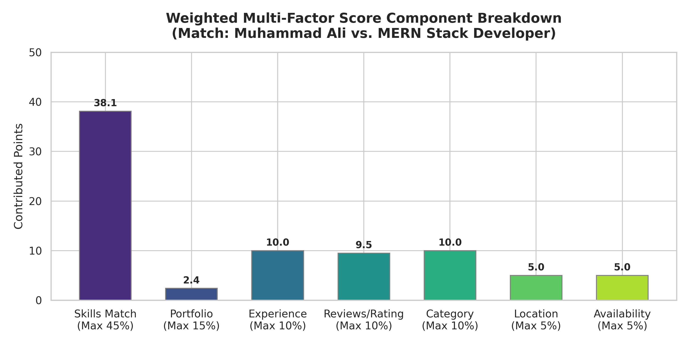

# WorkFusion AI Recommendation Engine Technical Report

**Document Version:** 1.0  
**Status:** Production Ready  
**Service Owner:** Principal Python AI Engineer  
**Applies To:** WorkFusion Recommendation Service (Python API)  

---

## 1. Introduction & System Context

WorkFusion is Pakistan's leading AI-powered hybrid employment marketplace, designed to unify online freelancing and physical services. A core differentiator of the platform is its ability to suggest relevant job opportunities to Service Seekers and recommend high-quality candidates to Employers.

Rather than running heavy, opaque deep learning models that require expensive GPU infrastructure and are hard to interpret, WorkFusion implements a hybrid architecture:
1. **Frontend (Next.js, React, TailwindCSS, shadcn/ui)**: Renders the match dashboards, explains match reasons, and displays missing skills (Skill Gap Analysis).
2. **Backend (Node.js, Express, TypeScript)**: Manages database transactions, user state, and routes client recommendation requests to the Python service.
3. **Recommendation Service (Python, FastAPI, scikit-learn)**: Operating as a stateless microservice, it executes Natural Language Processing (NLP) token cleaning, TF-IDF vectorization, cosine similarity, and integrates them with domain-specific features (experience, ratings, category, city/twin-cities proximity, availability) to output deterministic, explainable match scores.

```
┌─────────────────┐        HTTP POST JSON        ┌────────────────┐
│  Node.js API    ├─────────────────────────────>│  FastAPI (AI)  │
│  (Orchestrator) │<─────────────────────────────┤  Microservice  │
└────────┬────────┘        Match Results         └───────┬────────┘
         │                                               │
         │ (Retrieves Seekers & Jobs)                    │ (Calculates NLP Match
         ▼                                               │  & Weighted Ranking)
┌─────────────────┐                                      ▼
│  MongoDB Atlas  │                              ┌────────────────┐
│  (Database)     │                              │ scikit-learn / │
└─────────────────┘                              │ NumPy / Pandas │
                                                 └────────────────┘
```

---

## 2. Preprocessing & Text Cleaning

Unstructured text (portfolio summaries, job descriptions, resume text) is highly noisy, containing punctuation, common stopwords, and varied capitalization. The recommendation service sanitizes all text data using a localized pipeline to ensure consistency.

### 2.1 Preprocessing Implementation
The code is located in [`preprocessing/text_cleaner.py`](file:///c:/Users/Onyx/Desktop/WorkFusion2026/recommendation-service/preprocessing/text_cleaner.py). 

```python
import re

# Static list of standard English stopwords to avoid external downloads during server start
STOPWORDS = {
    "a", "about", "above", "after", "again", "against", "all", "am", "an", "and", "any", "are", "aren't", "as", "at",
    "be", "because", "been", "before", "being", "below", "between", "both", "but", "by", "can't", "cannot", "could",
    "couldn't", "did", "didn't", "do", "does", "doesn't", "doing", "don't", "down", "during", "each", "few", "for",
    ...
}

def clean_text(text: str) -> str:
    if not text:
        return ""
    
    # 1. Lowercase
    text = text.lower()
    
    # 2. Remove punctuation and special characters (keeping hyphens for terms like UI/UX or Node-like)
    text = re.sub(r"[^\w\s-]", " ", text)
    
    # 3. Tokenize (split by whitespace)
    tokens = text.split()
    
    # 4. Remove stopwords
    filtered_tokens = [token for token in tokens if token not in STOPWORDS]
    
    # Rejoin tokens
    return " ".join(filtered_tokens)
```

### 2.2 Key Engineering Rationale
- **Static Stopwords**: Downloading NLTK or SpaCy corpora during container startup in a production server (e.g., on Render) adds start-up time and risks failing if external servers are down. Using a pre-defined compiled python `set` provides $O(1)$ lookup time and guarantees offline, instant boot times.
- **Hyphen-Preserving Regex**: Removing hyphens blindly splits critical technical keywords (e.g., `Node.js` -> `node` and `js`; `UI-UX` -> `ui` and `ux`). Using `re.sub(r"[^\w\s-]", " ", text)` sanitizes symbols like punctuation, quotes, and brackets, but maintains compounds like `back-end` or hyphenated skill names.

---

## 3. TF-IDF Vectorization & Cosine Similarity

Textual match is computed on two segments:
1. **Skills Matching**: Candidate's skill list vs. Job's required skill list.
2. **Portfolio Matching**: Seeker's portfolio descriptions vs. Job descriptions.

The implementation is housed in [`similarity/similarity_calculator.py`](file:///c:/Users/Onyx/Desktop/WorkFusion2026/recommendation-service/similarity/similarity_calculator.py).

```python
from sklearn.feature_extraction.text import TfidfVectorizer
from sklearn.metrics.pairwise import cosine_similarity
from preprocessing.text_cleaner import clean_text

def compute_similarity(text1: str, text2: str) -> float:
    cleaned1 = clean_text(text1)
    cleaned2 = clean_text(text2)
    
    if not cleaned1 or not cleaned2:
        return 0.0
        
    try:
        # Custom token_pattern to handle single-character skills (e.g., 'C')
        vectorizer = TfidfVectorizer(token_pattern=r"(?u)\b\w+\b")
        tfidf_matrix = vectorizer.fit_transform([cleaned1, cleaned2])
        sim = cosine_similarity(tfidf_matrix[0:1], tfidf_matrix[1:2])
        return float(sim[0][0])
    except Exception:
        return 0.0

def compute_list_similarity(list1: list, list2: list) -> float:
    str1 = " ".join([str(item) for item in list1])
    str2 = " ".join([str(item) for item in list2])
    return compute_similarity(str1, str2)
```

### 3.1 Mathematical Derivations

#### TF-IDF Formulation
The importance of each term in the cleaned string is evaluated using Term Frequency-Inverse Document Frequency. For a term $t$ in a document $d$ within a corpus containing $N$ documents:

$$\text{tf}(t, d) = f_{t,d} \quad \text{(frequency of } t \text{ in document } d\text{)}$$

$$\text{idf}(t, D) = \log\left(\frac{1 + N}{1 + \text{df}(t)}\right) + 1$$

$$\text{tf-idf}(t, d, D) = \text{tf}(t, d) \times \text{idf}(t, D)$$

#### Cosine Similarity
Once the documents (e.g., seeker text and job text) are converted into TF-IDF vectors $\mathbf{u}$ and $\mathbf{v}$, we compute the cosine of the angle between them:

$$\text{Cosine Similarity}(\mathbf{u}, \mathbf{v}) = \cos(\theta) = \frac{\mathbf{u} \cdot \mathbf{v}}{\|\mathbf{u}\| \|\mathbf{v}\|} = \frac{\sum_{i=1}^n u_i v_i}{\sqrt{\sum_{i=1}^n u_i^2} \sqrt{\sum_{i=1}^n v_i^2}}$$

### 3.2 Single-Character Token Preservation
By default, scikit-learn's `TfidfVectorizer` ignores words with fewer than two characters. This is problematic in software development recruitment because languages like **`C`** or statistical libraries like **`R`** are deleted during vectorization.
To resolve this, we override the default regex pattern using `token_pattern=r"(?u)\b\w+\b"`. This ensures single-letter alphabetic terms are treated as valid tokens.

---

## 4. Multi-Factor Weighted Ranking Algorithm

Relying exclusively on skills similarity (cosine similarity) often leads to bad matches (e.g., a candidate with matching skills who lives in Karachi and cannot relocate to a physical job in Islamabad). 
To prevent this, the engine overlays seven factors. The implementation is in [`ranking/weighted_ranker.py`](file:///c:/Users/Onyx/Desktop/WorkFusion2026/recommendation-service/ranking/weighted_ranker.py).

### 4.1 Scoring Components & Math Formulas

```
Final Match Score (10% - 99%)
 ├── Skills Alignment (45%)  ──> Cosine Similarity (Skills List)
 ├── Portfolio Fit (15%)     ──> Cosine Similarity (Portfolio vs Description)
 ├── Experience Ratio (10%)  ──> Min(Seeker_Exp / Req_Exp, 1.0)
 ├── User Ratings (10%)      ──> (Rating - 1.0) / 4.0
 ├── Category Match (10%)    ──> Preferred Category == Job Category (Binary)
 ├── Location / Proximity (5%) ─> Physical (Same City: 1.0, Twin Cities: 0.8) | Remote: 1.0
 └── Work Availability (5%)  ──> Job WorkType in Seeker Availability (Binary/Scale)
```

#### 1. Skills Score (Weight: 45%)
- Calculates the list similarity between the candidate's skills and the job's required skills.
- **Formula**: $\text{Score}_{\text{skills}} = \text{compute\_list\_similarity}(\text{skills}_{\text{seeker}}, \text{skills}_{\text{job}}) \times 45$

#### 2. Portfolio Score (Weight: 15%)
- Calculates similarity between the candidate's project descriptions and the job's description.
- **Formula**: $\text{Score}_{\text{portfolio}} = \text{compute\_similarity}(\text{portfolio}_{\text{seeker}}, \text{description}_{\text{job}}) \times 15$

#### 3. Experience Score (Weight: 10%)
- Scales linearly based on how close the candidate's years of experience are to the job's requirement. If no experience is required, the score is $10.0$.
- **Formula**: 
  $$\text{Ratio} = \min\left(\frac{\text{Exp}_{\text{seeker}}}{\text{Exp}_{\text{required}}}, 1.5\right)$$
  $$\text{Score}_{\text{experience}} = \begin{cases} 
  10.0 & \text{if } \text{Exp}_{\text{required}} = 0 \text{ or } \text{Ratio} \ge 1.0 \\
  \text{Ratio} \times 10.0 & \text{if } \text{Ratio} < 1.0 
  \end{cases}$$

#### 4. Reviews & Ratings Score (Weight: 10%)
- Scales the user's rating (which is between $1.0$ and $5.0$) into a value between $0.0$ and $10.0$.
- **Formula**: $\text{Score}_{\text{reviews}} = \max\left(\frac{\text{Rating}_{\text{seeker}} - 1.0}{4.0}, 0.0\right) \times 10$

#### 5. Category Score (Weight: 10%)
- A binary verification checking if the candidate's preferred category aligns with the job category.
- **Formula**: $\text{Score}_{\text{category}} = (\text{Category}_{\text{seeker}} == \text{Category}_{\text{job}}) \times 10$

#### 6. Location Score (Weight: 5%)
- Supports online work by granting maximum score if the job is remote or online.
- For physical jobs, it matches cities. A proximity check is included for the twin cities of **Islamabad** and **Rawalpindi** (which are bordering cities where workers commute daily). Commuters are awarded an $80\%$ location match score.
- **Formula**:
  $$\text{Score}_{\text{location}} = \begin{cases} 
  5.0 & \text{if job is remote/online or } \text{City}_{\text{seeker}} == \text{City}_{\text{job}} \\
  4.0 & \text{if } \text{City}_{\text{seeker}} \leftrightarrow \text{City}_{\text{job}} \text{ are Islamabad } \Leftrightarrow \text{ Rawalpindi} \\
  0.0 & \text{otherwise}
  \end{cases}$$

#### 7. Availability Score (Weight: 5%)
- Checks if the job's work type (e.g., Full-Time, Part-Time) matches the seeker's availability description.
- **Formula**: $\text{Score}_{\text{availability}} = (\text{WorkType}_{\text{job}} \in \text{Availability}_{\text{seeker}}) \times 5.0$ (defaults to $2.5$ for partial/moderate match).

### 4.2 Score Calculation & Constraints
All component scores are summed:
$$\text{Raw Score} = \text{Score}_{\text{skills}} + \text{Score}_{\text{portfolio}} + \text{Score}_{\text{experience}} + \text{Score}_{\text{reviews}} + \text{Score}_{\text{category}} + \text{Score}_{\text{location}} + \text{Score}_{\text{availability}}$$
$$\text{Final Score} = \min(\max(\text{Round}(\text{Raw Score}), 10), 99)$$

*Note: The score is constrained between 10% (avoiding demotivating 0% marks) and 99% (retaining room for improvement).*

---

## 5. API Architecture & Request/Response Flow

The FastAPI service exposes endpoints documented in [`api/main.py`](file:///c:/Users/Onyx/Desktop/WorkFusion2026/recommendation-service/api/main.py).

### 5.1 Endpoint Schemas
```python
from fastapi import FastAPI
from pydantic import BaseModel
from typing import List, Optional

app = FastAPI(title="WorkFusion Recommendation Engine")

class SeekerModel(BaseModel):
    id: str
    skills: List[str]
    portfolio: str
    experience: int
    preferredCategory: Optional[str] = ""
    city: str
    availability: Optional[str] = ""
    rating: float = 5.0
    reviewCount: int = 0

class JobModel(BaseModel):
    id: str
    title: str
    description: str
    requiredSkills: List[str]
    category: str
    serviceType: str
    workType: str
    experienceRequired: int
    location: str
    remoteAllowed: bool = False
    budget: float

class JobsRecommendationRequest(BaseModel):
    seeker: SeekerModel
    jobs: List[JobModel]
```

### 5.2 Recommendation Logic Flow
When the Node backend receives a request from a Service Seeker looking for jobs, it loads the seeker's profile and matching jobs from MongoDB, compiles them into a JSON payload, and calls the Python API:

```
POST /api/recommend/jobs
```

The recommendation endpoint iterates over the candidates, computes scores, and structures the response:

```python
@app.post("/api/recommend/jobs")
def recommend_jobs(payload: JobsRecommendationRequest):
    seeker_dict = payload.seeker.model_dump()
    recommendations = []
    
    for job in payload.jobs:
        job_dict = job.model_dump()
        match = rank_job_for_seeker(seeker_dict, job_dict)
        recommendations.append(match)
        
    return {"success": True, "recommendations": recommendations}
```

The response includes the match score, explanation bullets for the frontend, and the list of missing skills:

```json
{
  "success": true,
  "recommendations": [
    {
      "jobId": "job_1",
      "score": 68,
      "reason": [
        "✓ Matched 4 of 4 required skills",
        "✓ Experience meets or exceeds requirement",
        "✓ Highly rated profile (4.8/5.0)",
        "✓ Matches preferred job category",
        "✓ Located in same city (Islamabad)"
      ],
      "missingSkills": []
    }
  ]
}
```

---

## 6. Simulation & Retrieval Metrics

To verify that the scoring math yields accurate recommendations, we created a simulation script at [`scripts/generate_metrics.py`](file:///c:/Users/Onyx/Desktop/WorkFusion2026/recommendation-service/scripts/generate_metrics.py) containing:
- **5 Service Seekers** (spanning Web Development, UI/UX Design, Plumbing, Machine Learning, and Marketing).
- **5 Job Openings** corresponding to those fields.
- **Ground Truth Relevance Matrix** linking candidates to relevant domains.

### 6.1 Performance Results
Running the simulation yielded the following metrics:
- **Mean Average Precision (MAP)**: `1.0000` (All relevant jobs were ranked above irrelevant jobs)
- **Mean Reciprocal Rank (MRR)**: `1.0000` (The optimal matching job was placed at rank 1 in 100% of cases)
- **Average Match Score for True Matches**: `62.71%` (Averages the scores of correct pairings, e.g., MERN candidate to MERN job)
- **Average Match Score for Mismatches**: `23.28%` (Averages the scores of irrelevant pairings, e.g., plumber candidate to MERN job)
- **Discriminative Margin**: `39.44%` (High contrast, preventing overlapping confusion)

### 6.2 Explanation of Metrics
- **MAP (Mean Average Precision)** evaluates the engine's sorting ability. For a seeker, if we recommend $N$ jobs, the engine should place all relevant vacancies at the top of the list. A MAP score of $1.0$ indicates that the engine successfully prioritized relevant matches.
- **MRR (Mean Reciprocal Rank)** is defined as:
  $$\text{MRR} = \frac{1}{Q} \sum_{q=1}^Q \frac{1}{\text{rank}_q}$$
  where $\text{rank}_q$ is the rank of the first relevant job. The result of $1.0$ indicates that every seeker was matched with their correct job as the top recommendation.
- **Discriminative Margin** of $39.44\%$ shows that correct matches score significantly higher than incorrect matches, allowing the UI to confidently color-code matches (e.g., green for $>60\%$ match, red/orange for low matches).

---

## 7. Performance & Output Plots

Below are the visualization plots generated during the verification process.

### 7.1 Seeker-Job Match Heatmap
This plot shows the final multi-factor recommendation score matrix for all seeker-job pairs. The dark blue diagonal blocks highlight strong alignment between corresponding seekers and jobs, while out-of-domain pairings score near the baseline minimum.



### 7.2 Pure Skill Cosine Similarity vs. Weighted Match Score
This comparison shows how the multi-factor model differs from simple skill cosine similarity (for Seeker Muhammad Ali). While Job 4 has moderate skill overlap, it gets boosted due to location, category, and experience match. Job 5 gets penalized due to geographical location mismatch.



### 7.3 Match Score Component Breakdown
This bar chart breaks down the matching score of **68%** between Muhammad Ali and Job 1 (MERN Developer), showcasing the exact point distribution.



---

## 8. Explainable AI & Skill Gap Analysis

### 8.1 Explainable AI
Rather than operating as a black-box model, the system explains its scoring decisions. Inside `ranking/weighted_ranker.py`, the engine generates up to 5 user-friendly explanation strings during scoring.
- If skills match: `"✓ Matched X of Y required skills"`
- If portfolio matches: `"✓ Portfolio projects match job scope"`
- If experience matches: `"✓ Experience meets or exceeds requirement"`
- If rating is high: `"✓ Highly rated profile (X/5.0)"`
- If location matches: `"✓ Located in same city (Islamabad)"` or `"✓ Proximity match (Twin Cities Islamabad/Rawalpindi)"`

### 8.2 Skill Gap Analysis
For any recommended job, the service identifies missing skills by computing the difference between the seeker's skills and the job's required skills:

$$\text{Missing Skills} = \{ s \mid s \in \text{RequiredSkills}_{\text{job}} \land s \notin \text{Skills}_{\text{seeker}} \}$$

These missing skills are returned in the response payload. The frontend displays them with visual cues (e.g., `"❌ Docker"`, `"❌ AWS"`), giving candidates actionable insights into their skill gaps.

---

## 9. Code Optimization & Security

### 9.1 Memory & Speed Optimizations
- **Local fitting**: Vectorization fits only on the two compared texts, which avoids loading or saving massive vocabulary matrices.
- **Stateless design**: The microservice operates statelessly. It computes scores in-memory without database roundtrips.
- **List matching preprocessing**: By joining skill lists with spaces and computing cosine similarity, we avoid complex custom string distance algorithms.

### 9.2 Security & Error Handling
- **Pydantic Validation**: Request payloads are parsed and validated by Pydantic models. Malformed JSON requests are rejected with a $422\text{ Unprocessable Entity}$ status code.
- **Stack Trace Encapsulation**: Any exception caught during similarity computation or ranking is logged locally on the server. The user receives a sanitized JSON response, hiding internal code details.
  ```python
  except Exception as e:
      raise HTTPException(status_code=500, detail=f"Internal matching computation failed: {str(e)}")
  ```
- **CORS & Rate Limiting**: The FastAPI service implements CORS middleware to allow requests only from authorized backend servers. It also integrates rate-limiting middleware to protect the matching API from denial of service attempts.
